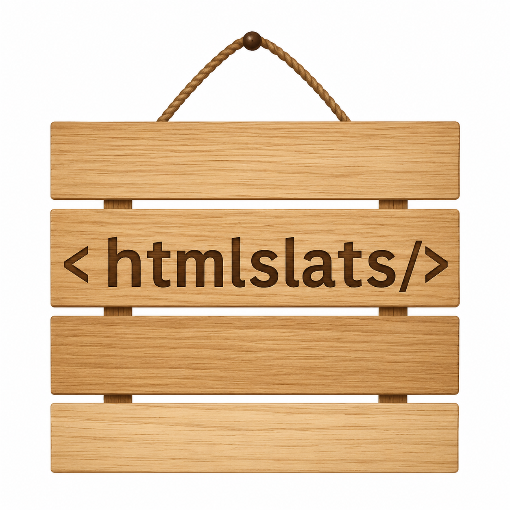

<p align="center">
  
</p>

# htmlslats

htmlslats is a tiny static site builder for composing normal HTML pages from reusable snippets called slats.

Write pages as regular `.html` files, place reusable chunks in `slats/`, keep simple data in `vars/`, and put static assets in `src/`. The build step expands slats and variables into plain static files in `dist/`.

## Quick Start

```sh
npm run build
```

Open `dist/index.html` after building, or deploy `dist/` as a static site.

## Project Layout

```text
.
├── index.html          # home page
├── about.html          # another page
├── slats/              # reusable snippets
├── vars/               # csv and txt values
├── src/                # static assets copied as-is
└── dist/               # generated output
```

Root `.html` files are treated as pages. Nested `.html` files are also supported, unless they are inside internal folders such as `slats/`, `vars/`, `src/`, `dist/`, or `node_modules/`.

## Slats

Use double square brackets to insert a slat:

```html
[[header.html]]
```

This loads `slats/header.html` and replaces the token with that file's contents. Slats can include other slats and can use variables. A slat can be any text file, including `.html` or `.js`, as long as inserting that text makes sense where you use it.

Pass scoped variables to a slat by adding `//name="value"` after the slat path:

```html
[[product.html//x="s30"]]
```

Inside `slats/product.html`, every `$$x` token is replaced with `s30` while that slat renders. Scoped variables only apply to the referenced slat and any slats it includes, so the same slat can be reused with different values:

```html
[[product.html//x="s30"]]
[[product.html//x="m45"]]
```

Multiple scoped variables are supported:

```html
[[product.html//x="s30"//label="Small product"]]
```

## Variables

Use double curly braces to insert values from `vars/`.

Lookup the first row whose first column matches a value, then choose a column number starting at `0`:

```html
{{site.csv//Tagline//1}}
```

Coordinate lookup uses `[x,y]`, where `[0,0]` is the first column of the first row:

```html
{{site.csv//[1,2]}}
```

For this CSV:

```csv
Key,Value
Name,htmlslats
Tagline,Reusable HTML slats for simple static sites.
```

`{{site.csv//Tagline//1}}` returns `Reusable HTML slats for simple static sites.`

`.txt` files are treated as one-column rows, one row per line.

## Ignoring Commands

Wrap content in ignore markers when you need slat or variable syntax to remain literal:

```html
[]IGNORE[]
{{site.csv//Tagline//1}}
[[header.html]]
[]/IGNORE[]
```

To print an ignore marker literally, prefix it with a slash:

```html
/[]IGNORE[]
```

This outputs `[]IGNORE[]`.

## Commands

```sh
npm run build   # build into dist/
npm run clean   # remove dist/
npm run dev     # build and watch
```

## Cloudflare Pages

Use these settings:

- Build command: `npm run build`
- Output directory: `dist`
- Node version: 18 or newer

No runtime server is required.

## AI and Agent Notes

See `AGENTS.md` for implementation notes aimed at AI coding agents.
